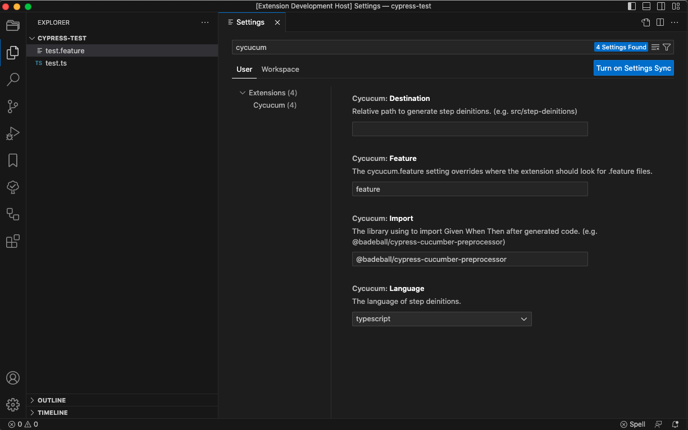

[](https://github.com/nguyenngoclongdev/cypress-cucumber-step-definition-generator/actions/workflows/pipelines.yml)


[](https://github.com/nguyenngoclongdev/cypress-cucumber-step-definition-generator/)

# Cypress Cucumber Step Definition Generator

This extension allows to generate automatically the step definitions of the gherkin steps of a feature and copy them to the clipboard or export them to file, powered by the [Gherkin](https://github.com/cucumber/gherkin).

This extension is maintained by the [Nguyen Ngoc Long](https://github.com/nguyenngoclongdev/).

# Installation

Get it from the [Visual Studio Marketplace](https://marketplace.visualstudio.com/items?itemName=nguyenngoclong.cypress-cucumber-step-definition-generator).

## Features

-   [Generate step definition](#generate-step-definition)
-   Language support
    -   JavaScript
    -   TypeScript

## Generate step definition


Different options available to Generate the Step Definition:

-   Generate step definition with creating a new file automatically as instructed by cypress-cucumber-preprocessor plugin.
-   Generate step definition and copy to clipboard
-   Generate step definition from Command Palette

## Using the extension

### Generate step definition with creating a new file automatically as instructed by cypress-cucumber-preprocessor plugin.

1. Open any .feature file in vs code editor
2. Right click on the editor and select `Cycucum: Generate step definitions to file`
3. Extension create the required folder structure i.e. folder with feature file name and then ts file under that folder if folder doesn't exists, otherwise append the existing step definition js file if already exits.


### Generate step definition and copy to clipboard

1. Open any .feature file in vs code editor
2. Right click on the editor and select `Cycucum: Generate step definitions to clipboard`


### Generate step definition from Command Palette


## Examples

```feature
Feature: Calculator
    As a user
    I want to use a calculator to add numbers
    So that I don't need to add myself

    Scenario: Add two numbers -2 & 3
        Given I have a calculator
        When I add "-2" and "3"
        Then the result should be "1"

    Scenario: Add two numbers 10 & 15
        Given I have a calculator
        When I add "10" and "15"
        Then the result should be "25"
```

```typescript
import { Given, When, Then } from '@badeball/cypress-cucumber-preprocessor';

Given(`I have a calculator`, () => {
    // The use of 'Given' keyword is to put the system in a familiar state before the user starts interacting with the system.
});

When(`I add {string} and {string}`, (arg1: string, arg2: string) => {
    // When the step is to define action performed by the user.
});

Then(`the result should be {string}`, (arg1: string) => {
    // The use of 'Then' keyword is to see the outcome after the action in when step.
});
```

## Configuration



### Change the default language

You could change the default language to generate:

```json
{
    "cycucum.language": "typescript"
}
```
For the default language: It should be set with language id defined in VS Code. The languages you could set are `javascript`, `typescript`.

### Change the import library

```json
{
    "cycucum.import": "@badeball/cypress-cucumber-preprocessor"
}
```

## Feedback

If you discover a bug, or have a suggestion for a feature request, please
submit an [issue](https://github.com/nguyenngoclongdev/cypress-cucumber-step-definition-generator/issues).

## LICENSE

This extension is licensed under the [MIT License](LICENSE)
